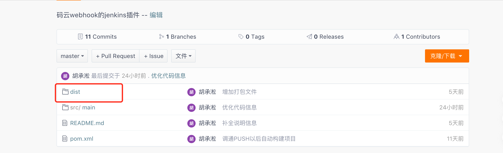
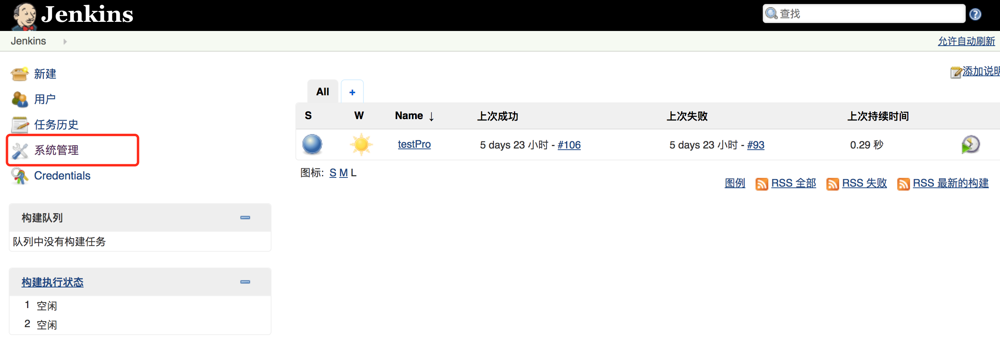
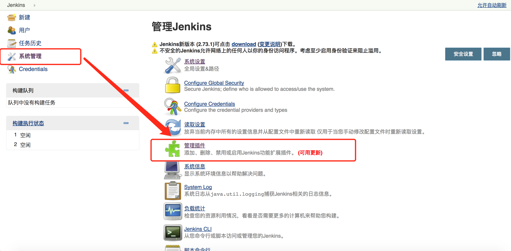
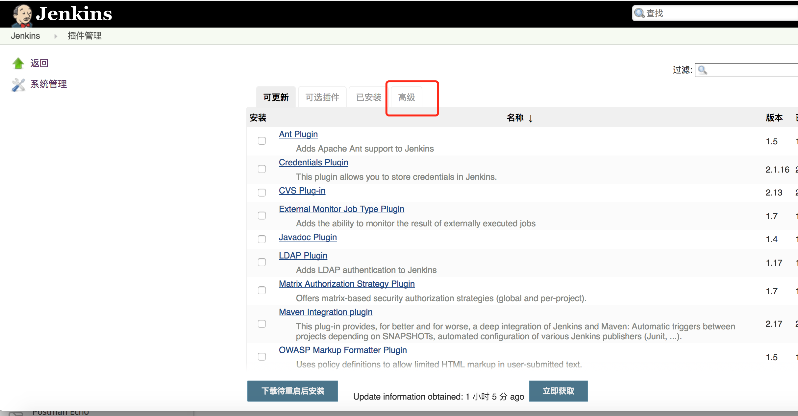
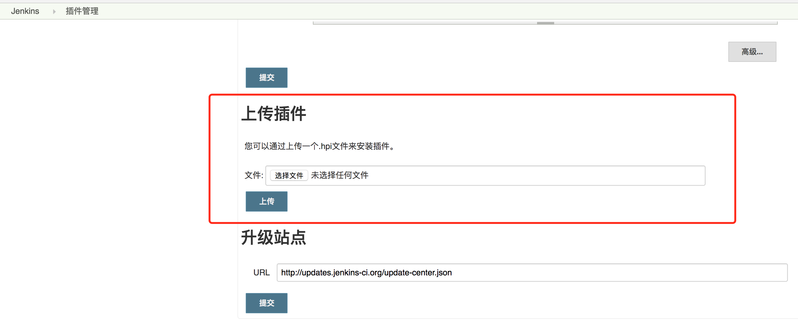
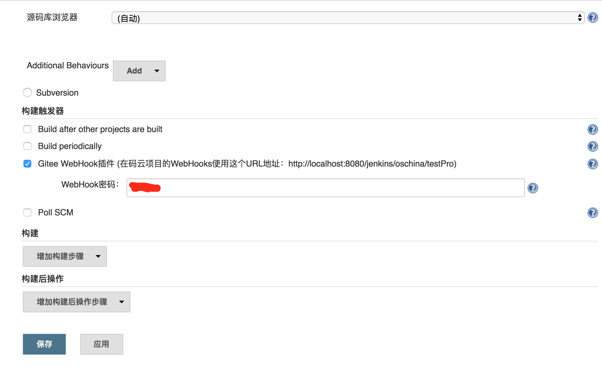
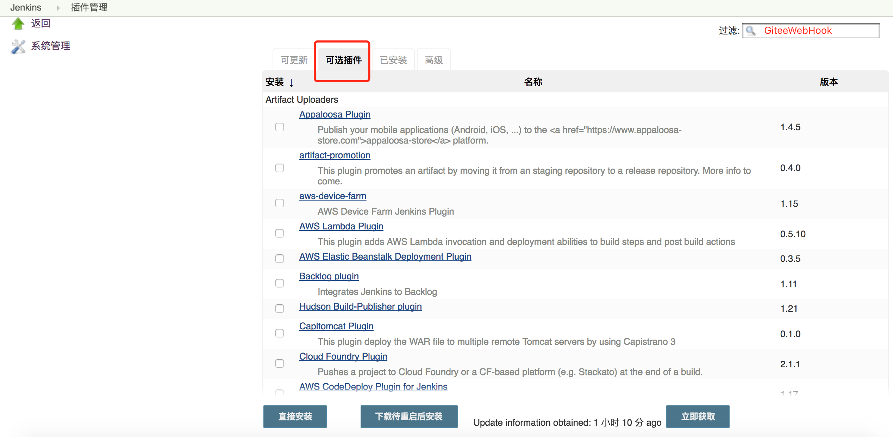

本插件参考自 [https://github.com/jenkinsci/coding-webhook-plugin](https://github.com/jenkinsci/coding-webhook-plugin) 并保留原项目的许可证。

### 安装方式

### 安装方式1 离线安装
- 去向插件地址 （[点我去向码云地址](https://git.oschina.net/oschina/jenkins-webhook-plugin.git)）

(**注：红框文件夹里就是打包好的插件，请下载到本地，一会儿有用**)
- 进入你的jenkins后台主界面

- 选择你的系统管理里面的管理插件

- 进入上传插件界面，并且选择你刚刚下载的插件(GiteeWebHook.hpi)，点击上传

- **重新启动Jenkins，这一步很重要，否则插件没有办法生效**

- 进入你当前已经存在的某一个任务，查看配置效果

### 安装方式2 在线安装
- 通过方式一的操作，进入到【管理插件】的界面

- 通过点击Tab页为【可选】的选项,并且输入相关关键字"GiteeWebHook"检索当前插件

- 点击安装插件，插件就会自动安装至完成

- 进入你当前已经存在的某一个任务，查看配置效果

